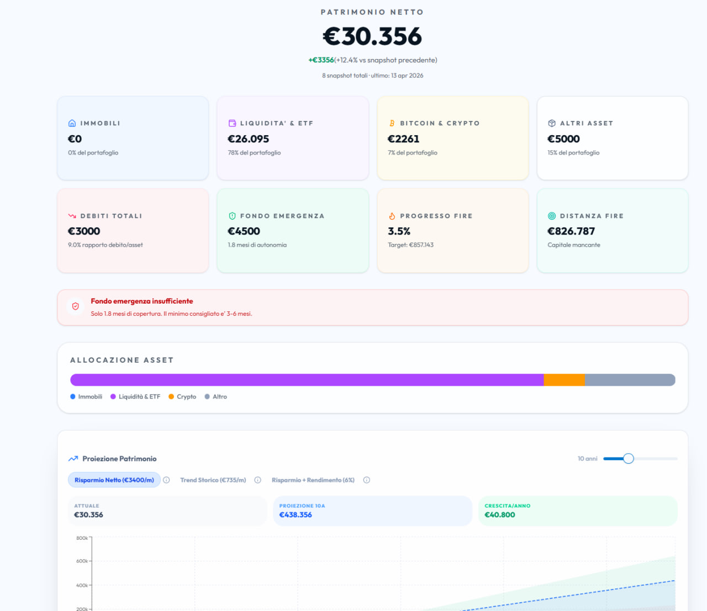
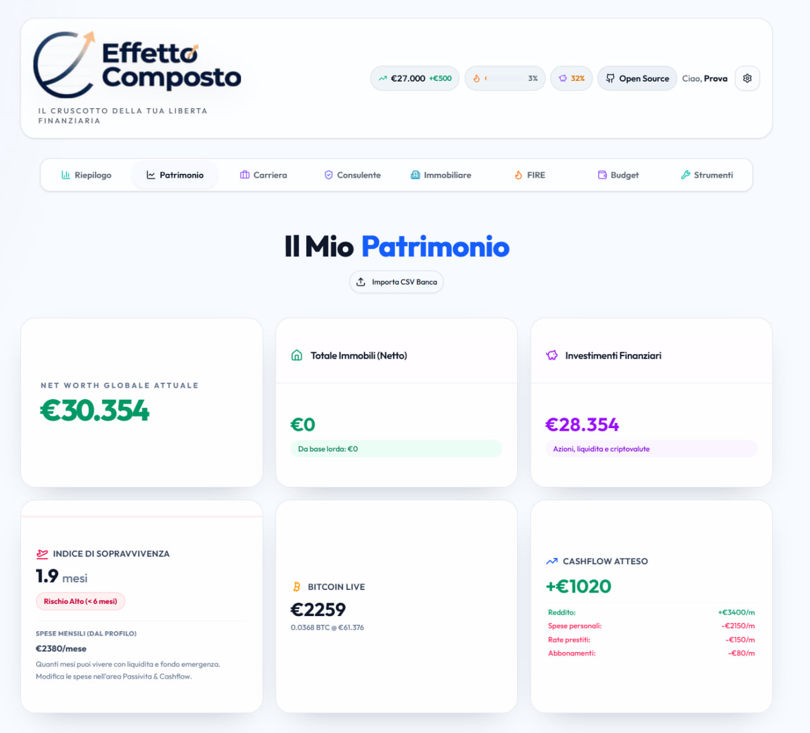
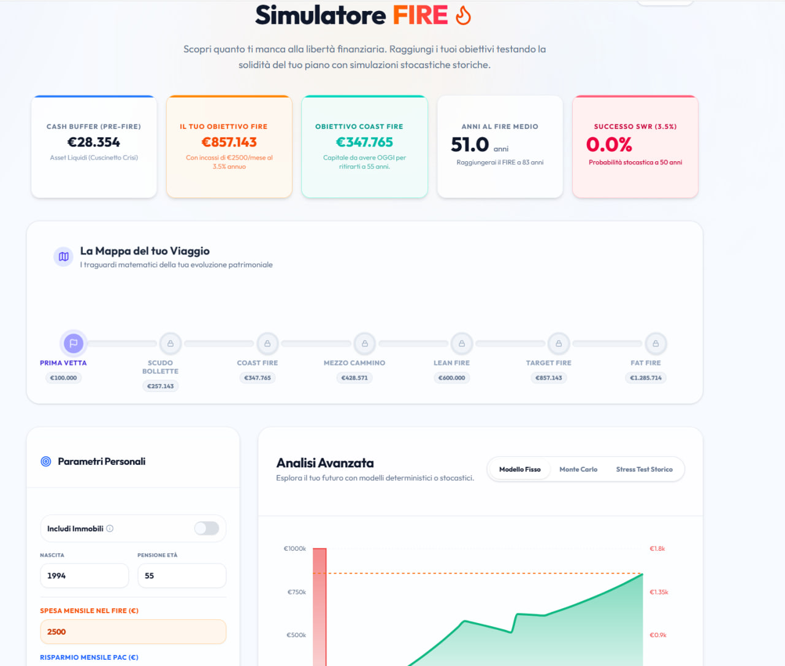
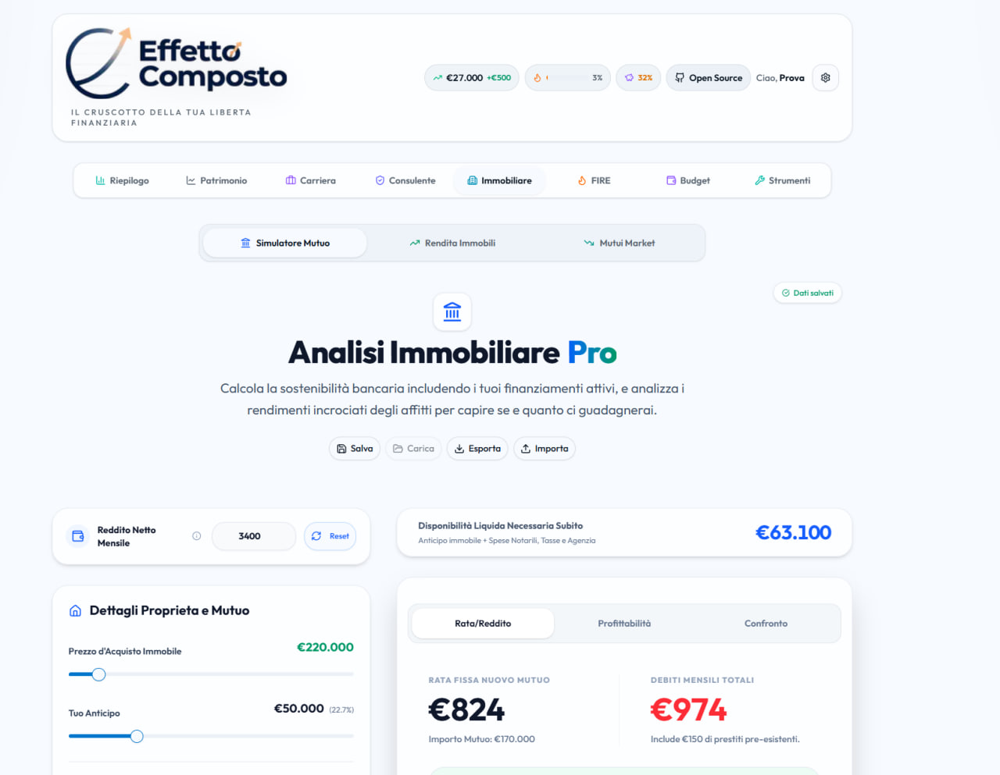
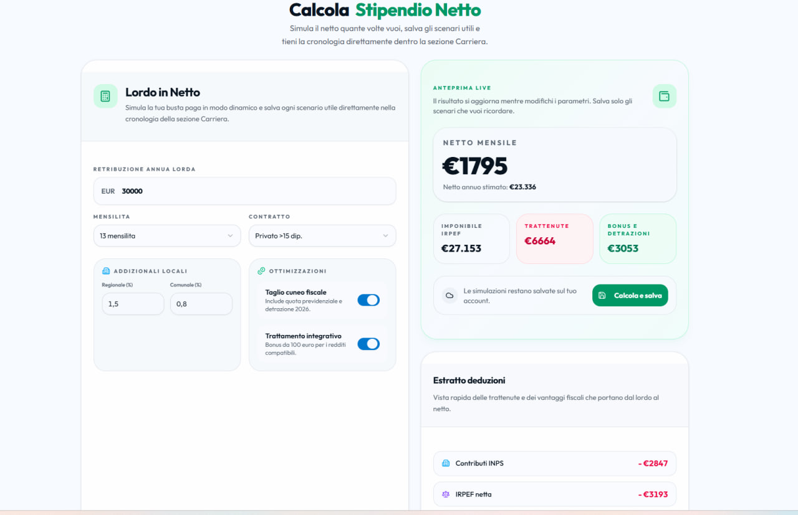
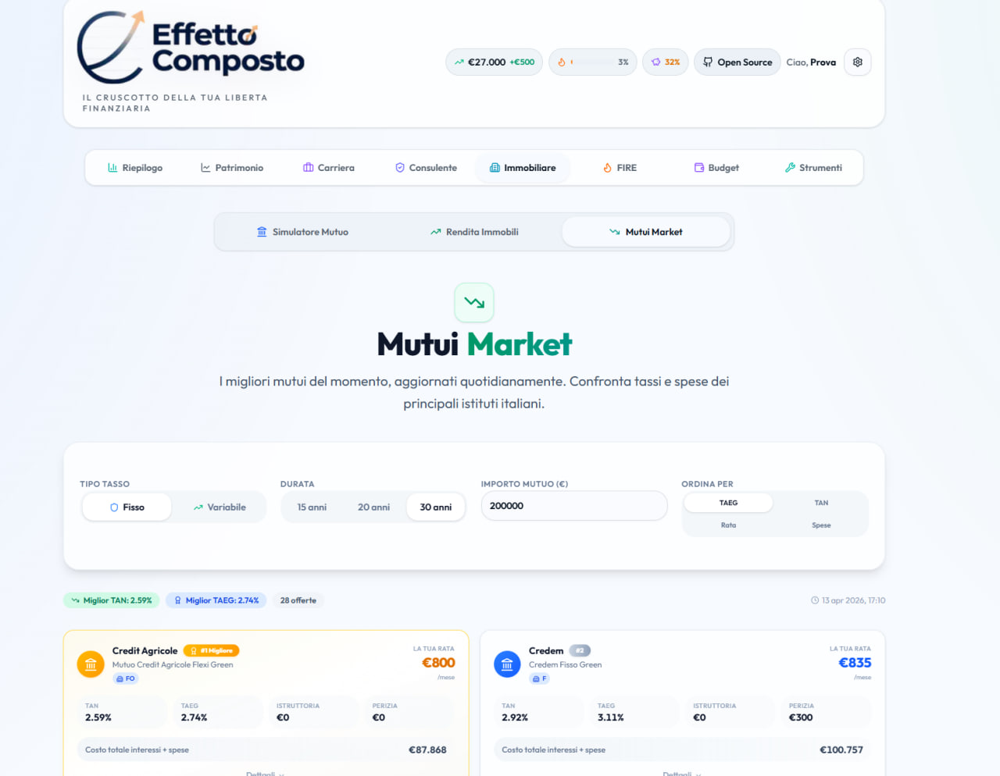

<div align="center">

# Effetto Composto

### La forza dell'interesse composto al servizio della tua indipendenza finanziaria

[](https://nextjs.org/)
[](https://react.dev/)
[](https://www.typescriptlang.org/)
[](https://tailwindcss.com/)
[](https://www.sqlite.org/)
[](https://creativecommons.org/licenses/by-nc/4.0/)

**[effettocomposto.it](https://effettocomposto.it)**

**Versione corrente:** `v0.4.0`

---

*Simulatore mutuo, calcolatore FIRE, tracker patrimonio, carriera, stipendio netto, budget e molto altro.*
*Tutto in italiano. Tutto gratuito. Tutto open-source.*

</div>

---

## 📸 Scopri l'App in Azione

<div align="center">
  
  <br/>
  
  <br/>
  
  <br/>
  
  <br/>
  
  <br/>
  
</div>

---

## Panoramica

**Effetto Composto** e' una webapp completa per la gestione della finanza personale, pensata per chi vuole raggiungere l'indipendenza finanziaria (FIRE). Unisce in un unico strumento tutto quello che serve per simulare, pianificare e monitorare il proprio percorso verso la liberta' finanziaria.

Installabile come app su smartphone (PWA), funziona anche offline e i calcoli pesanti girano su Web Worker per non bloccare l'interfaccia.

---

## Funzionalita'

### Simulazione e Calcolo

| Strumento | Descrizione |
|---|---|
| **Simulatore Mutuo** | Calcolo rata, ammortamento francese, confronto fino a 3 mutui side-by-side, analisi DTI (rata/reddito), analisi redditivita' acquisto vs affitto |
| **Calcolatore FIRE** | 10.000 simulazioni Monte Carlo via Web Worker, proiezione patrimonio, probabilita' di successo per anno target |
| **Interesse Composto** | Simulazione crescita capitale con versamenti periodici e reinvestimento |
| **Calcolatore Inflazione** | Impatto dell'inflazione sul potere d'acquisto nel tempo |
| **Viewer Movimenti Directa** | Importa il CSV dei movimenti da Directa Trading: dashboard con KPI, grafici cumulativi, flussi mensili, breakdown per strumento, riepilogo annuale e tabella filtrata (solo visualizzazione, nessun dato salvato) |
| **Advisor Acquisti** | Analisi dell'impatto di un acquisto sul percorso FIRE con grafici comparativi |
| **Lordo -> Netto** | Calcolo dinamico stipendio netto con IRPEF, INPS, addizionali, bonus, cronologia scenari salvati e richiamo rapido delle simulazioni |

### Monitoraggio e Gestione

| Strumento | Descrizione |
|---|---|
| **Tracker Patrimonio** | Snapshot giornalieri del patrimonio netto, gestione immobili, liquidita' e titoli separati, portafoglio con dividendi, prestiti attivi, proiezione futura e storico esportabile |
| **Budget Mensile** | Spese per categoria, import CSV estratto conto (Fineco, Intesa, formato generico) |
| **Obiettivi di Risparmio** | Target personalizzati con tracking progressi e deadline |
| **Tracker Abbonamenti** | Costi ricorrenti con riepilogo mensile e annuale |
| **Strategia Debiti** | Confronto metodo snowball vs avalanche per l'estinzione dei debiti |
| **Carriera** | Timeline retributiva e strumenti per stimare l'evoluzione del reddito nel tempo dentro la stessa area del dashboard |

### Riepilogo e Alert

| Strumento | Descrizione |
|---|---|
| **Dashboard Riepilogo** | KPI principali, asset allocation, overview completa |
| **Alert Automatici** | Notifiche su rapporto DTI, fondo emergenza insufficiente, deviazioni dal percorso FIRE |
| **Export CSV** | Esportazione dati patrimonio e ammortamento in CSV (UTF-8 con BOM) |

---

## Tech Stack

```
Frontend       Next.js 16 (App Router) + React 19 + TypeScript
Styling        Tailwind CSS 4 + Shadcn/UI (tema new-york)
Database       Prisma ORM + SQLite
Grafici        Recharts
Animazioni     Framer Motion
Performance    Web Workers (Monte Carlo), React.memo, lazy loading
PWA            Service Worker (cache-first statico, network-first API)
Testing        Vitest + GitHub Actions CI
Deploy         Docker + Traefik (HTTPS automatico via Let's Encrypt)
```

---

## Versioning

- **Fonte di verita'** - il numero versione del software vive in `package.json` (`version`) ed e' la base sia del repo sia del frontend
- **Regola di release** - ogni deploy applicativo su VPS deve includere bump versione + nuova voce nel changelog con lo stesso numero
- **Bump rapido** - per i prossimi rilasci puoi usare `npm run release:patch`, `npm run release:minor` oppure `npm run release:major`
- **UI discreta** - la versione corrente viene mostrata in piccolo sotto il brand nell'header, in grigio tenue, cosi' resta sempre verificabile senza sporcare la dashboard

---

## Changelog

### v0.4.0 - 17 aprile 2026 (Fondo pensione strutturato + PAC automatici)

- **FIRE meno ottimistico per ritiri anticipati** - il target FIRE usato da simulazione standard, stress test e Monte Carlo ora viene ricalcolato in base all'eta' effettiva di ritiro/soglia raggiunta, non solo sull'eta' pensionabile pianificata. Le pensioni pubbliche e le rendite future vengono quindi valorizzate solo quando partono davvero, evitando sottostime del capitale necessario per FIRE molto anticipati
- **Monte Carlo fino a fine vita utile** - il success rate non si ferma piu' a 30 anni o poco oltre: l'orizzonte della simulazione arriva fino alla `lifeExpectancy`, cosi' un FIRE a 40-45 anni viene stressato su tutta la durata prevista del piano
- **Cashflow FIRE separato dal risparmio familiare** - introdotto `monthlyPacBudget`: il campo FIRE diventa "PAC mensile extra al fondo pensione" e non viene piu' sovrascritto dal risparmio netto calcolato in Patrimonio. `monthlySavings` resta una metrica derivata del profilo familiare, mentre il budget investibile FIRE e' una preferenza dedicata
- **Fondo pensione per persona** - la configurazione del fondo pensione e' ora distinta per Persona 1 e Persona 2, con RAL annua dedicata, contributo volontario percentuale o fisso, contributo datore percentuale o fisso, TFR automatico e rimborso IRPEF calcolato per persona con cap deducibile separato
- **Accrediti automatici del fondo pensione in Patrimonio** - lo scheduler notturno applica il giorno 1 del mese gli accrediti dovuti di lavoratore, datore e TFR dentro `Altri Asset`, con ledger idempotente `PensionFundAccrual` e riepilogo di ultimo accredito, YTD e cumulato. Le modifiche manuali del saldo restano possibili e gli accrediti futuri si sommano al nuovo valore corrente
- **PAC automatici per singolo strumento** - ogni ETF/azione in Patrimonio ha un pulsante PAC con modal dedicata per creare, modificare, pausare o eliminare regole. Sono supportate cadenze settimanali, mensili, trimestrali, semestrali e annuali; piu' giorni sullo stesso asset si modellano con piu' regole
- **Motore PAC notturno idempotente** - lo scheduler controlla ogni notte le regole dovute, usa l'ultimo prezzo di chiusura disponibile dai provider gia' presenti, calcola quote frazionarie, aggiorna `customStocksList`/`stocksSnapshotValue` e registra ogni esecuzione come `executed`, `skipped` o `failed`
- **Export/import dati v2** - l'export utente include ora `monthlyPacBudget`, `pensionConfig`, regole PAC, esecuzioni PAC e accrual del fondo pensione. L'import v2 ripristina anche queste nuove entita' mantenendo compatibilita' con le chiavi legacy `patrimonio` e `obiettivi`
- **Milestone FIRE piu' trasparenti** - Lean/Fat FIRE vengono esplicitati come moltiplicatori euristici del target base, non come calcoli autonomi o garanzie di sostenibilita'
- **Copertura test ampliata** - aggiunti test su calcolo fondo pensione per persona, cap fiscale, TFR e scheduling PAC; suite aggiornata a 211 test passati

### v0.3.1 - 17 aprile 2026 (UX — Interesse Composto piu' educativo: punto di svolta + valore reale)

- **Nuova metrica "Punto di Svolta" nel calcolatore Interesse Composto** — il simulatore ora identifica ed evidenzia il primo anno in cui gli interessi maturati superano il totale dei contributi versati, rendendo concretamente visibile il momento in cui il capitale "lavora piu' di quanto venga alimentato". Il numero appare in una card KPI dedicata (icona Sparkles, accento amber) e la riga corrispondente nella tabella di ammortamento viene evidenziata con uno sfondo ambra e un'icona inline, cosi' l'utente puo' collegare a colpo d'occhio la metrica riassuntiva con il dettaglio anno per anno. Se l'orizzonte scelto e' troppo breve perche' l'incrocio avvenga (o il capitale iniziale parte gia' elevato rispetto ai contributi), la card mostra "non raggiunto in N anni" invece di un valore fuorviante
- **Nuovo slider Inflazione e KPI "Valore Reale"** — aggiunto un controllo dedicato all'inflazione attesa (0-10%, default 2.5%, step 0.1%) al pannello parametri. Il capitale finale viene deflazionato con fattore `(1 + i)^n` e mostrato in una nuova card KPI (icona TrendingDown, accento rose) come potere d'acquisto odierno, con sottotitolo esplicito "al netto X% inflazione". Prima dell'intervento il calcolatore comunicava solo valori nominali: un utente che simulava 30 anni con rendimento 7% vedeva cifre finali impressionanti ma senza alcun riferimento al loro reale potere d'acquisto, sottovalutando l'effetto erosivo dell'inflazione sulle proiezioni di lungo periodo. Ora il cruscotto restituisce contemporaneamente il dato nominale (capitale finale) e quello reale (valore reale), riallineando le aspettative a quanto davvero si potra' comprare con quel capitale
- **Perche' migliora l'esperienza** — queste due metriche trasformano il calcolatore da semplice simulatore numerico a strumento educativo: il "Punto di Svolta" materializza l'effetto compounding in un singolo numero memorizzabile ("dal dodicesimo anno il mio capitale produce piu' di quanto verso"), mentre il "Valore Reale" evita la trappola psicologica delle cifre nominali gonfiate dall'inflazione. Entrambi i KPI usano i pattern di UI gia' consolidati (card arrotondate, InfoTooltip per la spiegazione, palette consistente con il resto dell'app) senza introdurre dipendenze nuove
- **Compatibilita' totale** — nessun cambio alle API o ai tipi condivisi, la suite di 196 test unitari resta verde, calcoli derivati centralizzati in un singolo `useMemo` con dipendenze corrette incluso `inflationRate`

### v0.3.0 - 17 aprile 2026 (AI con allegati + FIRE coerente)

- **AI Advisor ora accetta immagini e PDF** - la chat supporta allegati reali via picker o incolla, con anteprima nel composer, rendering dentro i messaggi, persistenza nei thread e recupero protetto via API. OpenRouter riceve content parts compatibili con immagini/file e Gemini usa `inlineData`, con limiti centralizzati su numero e peso dei file
- **Persistenza completa degli allegati AI** - introdotto il modello Prisma `AssistantAttachment` e il salvataggio multipart su `/api/ai/threads/[id]/messages`, cosi' le conversazioni restano rileggibili anche dopo reload e un thread senza testo puo' usare il filename dell'allegato come titolo iniziale
- **FIRE piu' realistico sugli immobili** - il valore degli immobili non entra piu' nel capitale FIRE: contano solo le rendite nette, anche future, ricavate da `rentStartDate` e convertite in stream passivi nel motore Coast FIRE. Header KPI, tab FIRE e Riepilogo usano ora la stessa `computeFireMetricsFromSnapshot()` per evitare discrepanze
- **Dashboard sincronizzate in tempo reale** - cambi a patrimonio, preferenze FIRE o acquisti accettati propagano subito un evento client-side, cosi' overview, KPI in header e simulatore FIRE si aggiornano senza restare con dati stantii tra un tab e l'altro
- **Regressioni coperte lato FIRE** - aggiunti test su rendite passive future, rendite negative e calcolo centralizzato delle metriche FIRE per bloccare ritorni di incoerenze sul target netto

### v0.2.6 - 17 aprile 2026 (UX — validazione input numerici: vincolo min su tutti i campi finanziari)

- **Prevenzione valori negativi su tutti gli input numerici della piattaforma** — aggiunti attributi HTML `min="0"` (per importi e percentuali) e `min="1"` (per durate in anni e notti) su circa 50 campi `<Input type="number">` distribuiti in 10 componenti. Prima dell'intervento, l'utente poteva digitare valori negativi per importi mutuo, saldi debiti, tassi di interesse, canoni di affitto, costi IMU, quantita' BTC, contributi mensili e numerosi altri campi finanziari, producendo dati logicamente invalidi che si propagavano nei calcoli derivati (grafici, proiezioni FIRE, confronti mutui, strategie debito). Il browser ora impedisce la selezione di valori sotto la soglia tramite spinner e validazione nativa, fornendo un primo livello di difesa lato client senza modificare la logica applicativa esistente
- **Componenti aggiornati**: `inflation-calculator`, `subscription-tracker`, `debt-strategy`, `compound-interest-calculator`, `progressione-dashboard`, `patrimonio-dashboard`, `patrimonio/real-estate-section`, `rental-income`, `mortgage-simulator/mortgage-inputs`, `mortgage-simulator/mortgage-comparison`

### v0.2.5 - 17 aprile 2026 (fix critico — divisione per zero nei calcoli finanziari)

- **Bug finanziario critico risolto: divisione per zero in 4 moduli di calcolo** — identificata e corretta una famiglia di vulnerabilita' matematiche che producevano `NaN`, `Infinity` o loop infiniti quando l'utente inseriva valori zero o di confine per parametri critici (durata mutuo, tasso di prelievo SWR, rata minima debiti). I valori corrotti si propagavano nei grafici, nei KPI e nelle proiezioni FIRE, rendendo l'intera dashboard finanziariamente inaffidabile
- **Confronto Mutui (`mortgage-comparison.tsx`)** — con `anni = 0` (campo svuotato dall'utente), `numPayments = 0` causava divisione per zero nella formula della rata mensile francese `(P * r * (1+r)^n) / ((1+r)^n - 1)` e nel calcolo del debito residuo `P * ((1+r)^n - (1+r)^k) / ((1+r)^n - 1)`, producendo `Infinity` nella rata, `NaN` nel grafico Debito Residuo nel Tempo e valori assurdi nel riepilogo confronto. Fix: guard `numPayments > 0` prima di ogni divisione, con fallback a rata zero e debito residuo pari all'importo originale
- **Coast FIRE (`coast-fire.ts`)** — con `withdrawalRatePct = 0`, il FIRE target lordo `annualExpenses / (swr / 100)` produceva `Infinity`, che si propagava nel Coast FIRE target, nelle tre varianti Bear/Base/Bull e nel gap "quanto ti manca". Fix: clamp SWR a minimo 0.1% (`Math.max(0.1, withdrawalRatePct)`), allineato alla stessa guardia gia' presente in `fire-projection.ts` ma mancante in `coast-fire.ts`
- **Dashboard FIRE (`fire-dashboard.tsx`)** — stessa divisione per zero del Coast FIRE nel calcolo `grossFireTarget = annualExpenses / (fireWithdrawalRate / 100)`. Fix: stessa guardia `Math.max(0.1, ...)` applicata anche qui per coerenza
- **Strategia Debiti (`debt-strategy.ts`)** — con debiti a saldo zero/negativo o rata minima zero e nessun extra mensile, la simulazione snowball/avalanche entrava in un loop di 600 iterazioni senza progredire (nessun pagamento effettuato, interessi che si accumulano). Fix: filtro preventivo dei debiti con `balance <= 0`, clamp `rate` e `minPayment` a >= 0, early return quando il budget totale e' zero, e soglia di completamento abbassata da `0.01` a `0.005` per evitare residui fantasma
- **18 nuovi unit test** — `mortgage-comparison.test.ts` (12 test: rata standard, anni=0, tasso=0, tasso=0+anni=0, anticipo>=prezzo, prezzo=0, anni negativi, debito residuo a t=0/t=meta'/t=fine, debito con numPayments=0, debito a tasso 0%), `coast-fire.test.ts` (+3 test: SWR=0, SWR negativo, spese=0), `debt-strategy.test.ts` (+3 test: debiti con saldo zero/negativo, budget zero senza loop infinito, tassi negativi). Suite totale: **190 test passati**

### v0.2.4 - 17 aprile 2026 (UX — skeleton loader Abbonamenti Ricorrenti)

- **Skeleton loader per il tracker abbonamenti** — il componente `SubscriptionTracker` restituiva `null` durante il caricamento asincrono delle preferenze utente, lasciando un vuoto visivo nella pagina fino al completamento della fetch. Ora mostra uno skeleton strutturato che replica il layout reale del componente (titolo con icona, 3 righe abbonamento placeholder, e le due card riepilogo costo mensile/annuale), allineandosi al pattern gia' adottato nei tab FIRE, Riepilogo e nel fallback globale dei tab lazy-loaded. L'utente percepisce immediatamente il tipo di contenuto in arrivo invece di fissare un buco vuoto, migliorando la perceived loading performance specialmente su connessioni lente e dispositivi mobili

### v0.2.3 - 17 aprile 2026 (fix FIRE in tempo reale)

- **Mappa FIRE coerente in tempo reale** - il target FIRE, la timeline del viaggio, le milestone e le linee di riferimento ora si ricalcolano subito usando il capitale netto realmente richiesto dal piano, quindi modifiche a pensione pubblica, eta' pensionabile, eta' FIRE, rendita immobiliare e altri parametri aggiornano tutta la schermata in modo allineato
- **Auto-salvataggio piu' rapido e trasparente** - le preferenze FIRE vengono salvate con debounce piu' corto e la UI mostra chiaramente quando ci sono modifiche in attesa oppure un salvataggio in corso
- **Persistenza completata per i parametri FIRE** - `monthlySavings` e `includeIlliquidInFire` entrano nello schema validato, nel database e nel caricamento iniziale, evitando stati incoerenti tra impostazioni mostrate e dati realmente salvati
- **Test dedicati sulla logica Coast FIRE** - aggiunta copertura per verificare che pensione pubblica ed eta' pensionabile riducano davvero il target netto e il capitale richiesto

### v0.2.2 - 17 aprile 2026 (fix UI AI: solo risposta finale in italiano)

- **Niente piu' ragionamenti interni visibili in chat** - il bridge Gemini/Gemma ora filtra i `Part` marcati come `thought`, cosi' l'utente vede solo la risposta finale dell'assistente invece di thought summaries o note interne del modello
- **Comportamento italiano rinforzato** - il prompt operativo dell'AI Advisor esplicita che devono essere mostrati solo output finali rivolti all'utente, sempre in italiano, senza checklist o testo di lavoro
- **Test di regressione sul caso reale** - aggiunta copertura per il caso in cui Gemini restituisce un thought in inglese seguito dalla risposta finale in italiano, in modo da evitare ricadute su future modifiche del provider

### v0.2.1 - 17 aprile 2026 (fix AI Gemini)

- **Fix errore 400 Gemini su tool calling con enum numerici** - le `functionDeclarations` inviate a Gemini contenevano `enum` numerici (per esempio `mensilita` e `durata mutuo`) che l'API rifiuta se non rappresentati come stringhe. Il bridge Gemini ora normalizza ricorsivamente gli schemi dei tool convertendo `enum`, `type` e `default` in formato compatibile solo per il provider Google, senza alterare il comportamento OpenRouter
- **Copertura di regressione dedicata** - aggiunto un test su `geminiSanitizeSchema()` per bloccare il ritorno di questo bug su futuri tool con enum numerici

### v0.2.0 — 16 aprile 2026 (versioning release)

- **Numero versione ufficiale nel repo** - `package.json` diventa la fonte canonica della versione software e viene portato a `v0.2.0`, con script dedicati per incrementi `patch`, `minor` e `major`
- **Versione visibile anche nel frontend** - aggiunta una micro-etichetta grigia sotto il logo nell'header principale, pensata per essere sempre disponibile ma visivamente discreta
- **Processo di rilascio reso esplicito** - documentato nel repository che ogni deploy applicativo deve allineare numero versione e changelog, cosi' l'avanzamento del software resta sempre tracciabile

### 16 aprile 2026 (fix critico debiti — rollover rate minime + edge-case obiettivi e Monte Carlo)

- **Bug finanziario critico risolto: strategia Snowball/Avalanche senza rollover** — `simulatePayoff()` in `debt-strategy.tsx` non ridirezionava le rate minime dei debiti estinti verso il debito prioritario successivo. Questo e' il meccanismo fondamentale di entrambe le strategie: quando un debito viene saldato, la sua rata minima diventa budget aggiuntivo per accelerare l'estinzione del debito successivo. Il codice originale inizializzava `remaining = extraMonthly` ad ogni iterazione, ignorando completamente le rate liberate. Con il fix, il budget mensile totale e' calcolato come `somma(tutte le rate minime) + extraMonthly`, le rate minime attive vengono scalate dal budget, e tutto il residuo (incluse le rate dei debiti gia' estinti) viene applicato al debito prioritario. Esempio concreto: con 2 debiti (Carta €5.000 min €100 al 18%, Auto €12.000 min €250 al 5.5%) e €200 extra, il vecchio codice produceva una simulazione piu' lenta perche' dopo aver estinto la Carta, i €100/mese della sua rata svanivano nel nulla invece di accelerare l'Auto
- **Modulo `src/lib/finance/debt-strategy.ts` estratto e testato** — la logica di simulazione e' stata estratta dal componente UI in un modulo puro importabile e testabile, con 12 nuovi unit test che coprono: lista vuota, singolo debito, rollover a 2 e 3 debiti, ordinamento snowball/avalanche, avalanche < snowball in interessi, overpayment quando rata > saldo, tasso zero, safety cap 600 mesi, e extra = 0
- **Fix obiettivi scaduti: importo fuorviante** — `getDeadlinePacing()` in `savings-goals.tsx` restituiva `requiredMonthly: remaining` (l'intero importo mancante) per obiettivi con scadenza superata, mostrando es. "€5.000/mese" come se fosse un contributo mensile quando in realta' era il totale residuo. Ora restituisce `requiredMonthly: 0` e l'UI mostra correttamente l'importo mancante con label "ancora da risparmiare". Inoltre, `historicalMonthly` non viene piu' forzato a 0 per gli obiettivi scaduti: il ritmo storico di risparmio resta visibile come contesto utile
- **Fix indice percentili Monte Carlo** — in `monte-carlo.worker.ts`, gli indici per p10/p50/p90 calcolati con `Math.floor(runsCompleted * 0.9)` potevano teoricamente accedere fuori dall'array per chunk molto piccoli. Aggiunto `Math.min(..., runsCompleted - 1)` come clamp di sicurezza
- **Suite test** — da 156 a **168 test passati** (+12 nuovi test su `debt-strategy.test.ts`)
### 16 aprile 2026 (AI persistente, Performance, Dividendi e Report)

- **AI Advisor con thread persistenti e memoria utente su database** - la chat AI non vive piu' solo nello stato client: sono stati aggiunti thread salvati (`AssistantThread` + `AssistantMessage`) con sidebar conversazioni, rinomina/eliminazione, memoria persistente (`AssistantMemory`) con pin manuale e auto-estrazione dei fatti stabili dalle conversazioni. Il vecchio store `session-memory` e' stato rimosso e il system prompt ora combina profilo utente, snapshot dati e memoria storica.
- **Tool calling AI molto piu' ampio (23 strumenti)** - l'assistente puo' interrogare patrimonio, storico net worth, allocazione asset, performance portafoglio, dividendi, budget, obiettivi, preferenze, portafoglio titoli, quote bond via ISIN, oltre a eseguire calcoli Coast FIRE, sensitivity matrix FIRE, Monte Carlo, ammortamento mutuo, stipendio netto, sale tax e piani di accumulo. In pratica l'AI passa da "chat con qualche tool" a vero copilota operativo sui dati dell'utente.
- **Nuovo tab Performance** - aggiunta una dashboard dedicata con metriche ROI, CAGR, TWR, MWR/IRR, volatilita', Sharpe ratio, max drawdown, drawdown corrente e durata/recovery, piu' heatmap dei rendimenti mensili, grafico underwater e calendario dividendi. Inclusa anche una finestra di analisi AI focalizzata sulla performance del portafoglio.
- **Dividendi e bond entrano nel prodotto in modo strutturato** - nuovo modello `DividendRecord` con API CRUD, endpoint statistiche, scraping storico dividendi da Borsa Italiana per ISIN, ritenuta italiana applicata automaticamente e conversione in EUR. In parallelo il recupero prezzi titoli supporta ora il fallback per obbligazioni italiane via MOT/Borsa Italiana e nel portafoglio compare una modal per simulare l'impatto fiscale di una vendita (26% azioni/ETF, 12.5% titoli di stato, con compensazione minusvalenze).
- **FIRE piu' ricco e piu' robusto** - il dashboard FIRE ora include il pannello "Coast FIRE - scenari di mercato" e la matrice di sensitivita' spese/risparmio; inoltre e' stato corretto un bug potenziale di Rules of Hooks legato al worker Monte Carlo, spostando `useRef` e cleanup prima degli early-return.
- **Export report patrimoniale pronto per PDF/stampa** - nel top bar appare il nuovo `ExportReportModal`, da cui l'utente sceglie quali sezioni includere (Patrimonio, Allocazione, Performance, FIRE, Mutuo/Debiti, Dividendi). Il report viene generato su `/report/export`, impaginato per stampa e pensato per essere salvato facilmente in PDF dal browser.
- **Refactor dati e compatibilita' mercati** - `user-data` ora esporta anche i dividendi, i tassi FX coprono anche CHF/JPY/CAD/AUD oltre a USD/GBP, e la normalizzazione prezzi/dividendi in EUR e' stata centralizzata in `normalizePriceToEur()` per evitare conversioni duplicate e incoerenti tra route diverse.

### 16 aprile 2026 (UX — allocazione asset leggibile e accessibile nel Riepilogo)

- **Percentuali visibili nella legenda allocazione asset** — la barra di asset allocation nel tab Riepilogo mostrava le percentuali di ogni categoria (Immobili, Liquidita' & ETF, Crypto, Altro) solo tramite attributo `title` sulle sezioni colorate della barra. Gli utenti su mobile e tablet non potevano in alcun modo visualizzare questi valori (il `title` richiede hover con il mouse). Ora ogni voce della legenda mostra il valore percentuale in grassetto accanto al nome della categoria, rendendo l'informazione immediatamente visibile su qualsiasi dispositivo senza necessita' di interazione
- **Accessibilita' screen reader** — aggiunto `role="img"` e `aria-label` descrittivo alla barra di allocazione, cosi' gli screen reader leggono il breakdown completo ("Allocazione asset: Immobili 45.2%, Liquidita' & ETF 30.1%, ...") invece di ignorare silenziosamente un elemento puramente decorativo. Rimossi i `title` individuali dai segmenti (ora ridondanti con la legenda visibile e l'aria-label sul contenitore)
- **Pulizia dead code** — rimossa la variabile `sparkData` (array di 30 punti per sparkline) che veniva calcolata dentro il `useMemo` principale ma mai restituita ne' renderizzata, eliminando un'allocazione inutile ad ogni ricalcolo delle metriche

### 16 aprile 2026 (fix critico FIRE — rendita immobiliare negativa + IRPEF + UI)

- **Bug finanziario critico risolto: rendita immobiliare negativa ignorata** — `calculatePropertyAnnualNetIncome()` in `src/lib/finance/real-estate.ts` applicava `Math.max(0, rent - totalCosts)`, azzerando silenziosamente la perdita di immobili in cui i costi superano l'affitto. Quando un utente aveva sia un immobile redditizio (+€9k) sia uno in perdita (-€2.5k), il sistema calcolava un reddito passivo totale di €9k invece del corretto €6.5k, sottostimando il target FIRE di decine di migliaia di euro (es. con SWR 4% e spese €30k/anno: target calcolato €525k invece del corretto €587.5k, errore di **€62.5k / 12%**). Il bug si propagava nel Monte Carlo, nel calcolo deterministico FIRE, nel Coast FIRE e nel consulente acquisti — ovunque venisse usata `sumRealEstateAnnualNetIncome()`. Fix: rimosso il floor, la rendita netta puo' ora essere negativa e viene correttamente compensata nella somma aggregata
- **IRPEF_BRACKETS costante disallineata** — il secondo scaglione in `src/lib/constants.ts` dichiarava aliquota 0.35 (35%, scaglioni 2024) ma il motore di calcolo effettivo `irpef.ts` usava correttamente 0.33 (33%, scaglioni 2026). Aggiornata la costante e il commento a "IRPEF 2026" per prevenire errori in futuri refactor che la importassero al posto dei valori hardcoded
- **Fix NaN nel calcolatore interesse composto** — quando capitale iniziale e contributo mensile erano entrambi 0, la percentuale "da interessi composti" calcolava `0/0 = NaN`, mostrando "NaN%" nell'UI. Aggiunto guard: se il bilancio finale e' zero, mostra 0%
- **Pulizia dead code IRPEF detrazioni** — `Math.max(690, 1955)` in `irpef.ts` restituiva sempre 1955 (690 e' strettamente minore): semplificato a `1955` per chiarezza
- **Test aggiornati e nuovi** — aggiornato il test `real-estate.test.ts` per verificare che la rendita negativa venga correttamente propagata (non piu' azzerata), aggiunto test di regressione che dimostra l'impatto sul reddito passivo aggregato con immobili misti, aggiornato `constants.test.ts` per aspettarsi 0.33 nel secondo scaglione. Suite totale: **156 test passati**

### 16 aprile 2026 (UX — skeleton loader per caricamento tab e simulatore FIRE)

- **Skeleton loader globale per tutti i tab** — il `TabFallback` usato come Suspense fallback per tutti i 9 tab lazy-loaded e' stato trasformato da un semplice spinner centrato in uno skeleton strutturato che mima il layout tipico di una dashboard: blocco hero con titolo/sottotitolo, griglia di 4 card metriche e area grafico. Cosi' l'utente percepisce immediatamente il tipo di contenuto in arrivo invece di fissare uno spinner anonimo, migliorando significativamente la perceived loading performance su ogni cambio tab (specialmente su connessioni lente o dispositivi meno potenti)
- **Skeleton dedicato per il simulatore FIRE** — il tab FIRE (uno dei piu' pesanti: ~1150 righe, fetch preferenze + patrimonio + calcoli derivati) ora mostra uno skeleton strutturato durante il caricamento iniziale dei dati, con 5 card KPI placeholder, barra tab e area grafico. Prima il componente renderizzava immediatamente con tutti i valori a zero (€0 patrimonio, 0 anni al FIRE, obiettivo €0) causando un flash confuso di dati falsi prima che i valori reali apparissero — un pattern che poteva sembrare un bug. L'`isLoadingUser` flag gia' presente e' stato riutilizzato come gate per il rendering dello skeleton, senza aggiungere stato nuovo
- **Cleanup import** — rimossa l'importazione inutilizzata di `Loader2` da `page.tsx` (l'icona spinner non serve piu' nel nuovo TabFallback basato su Skeleton)

### 16 aprile 2026 (AI Advisor v2 — profilo utente, tool calling, derived data, API key cifrata)

- **"Parlami di te" — profilo personale persistente iniettato in ogni prompt** — nuovo pulsante in header al tab AI che apre un modal con textarea libera (max 8000 caratteri) dove l'utente racconta eta', lavoro, situazione familiare, obiettivi di vita, tolleranza al rischio, vincoli e preferenze d'investimento. Il testo viene salvato sul DB nel modello `Preference.aiUserProfile` (cross-device, sopravvive ai refresh) e iniettato in ogni system prompt come blocco dedicato `--- PROFILO UTENTE ---` separato dallo snapshot dati. Cosi' l'AI ha sempre il contesto su CHI sei prima di guardare i numeri. Status bar mostra "Profilo: compilato (N car.)" / "vuoto — clicca per compilare" come scorciatoia
- **Tool calling — l'AI esegue calcoli precisi invece di stimare a parole** — registry di 7 tool dichiarati in `src/lib/ai/tools.ts` e supportati su entrambi i provider (Gemini con `functionDeclarations`, OpenRouter con formato OpenAI `tools`/`tool_calls`). I tool: `calculate_mortgage_amortization` (rata francese + schema annuale), `calculate_net_salary` (RAL → netto IRPEF/INPS/cuneo 2025-2026 riusando `lib/finance/irpef.ts`), `run_fire_monte_carlo` (2000 traiettorie con percentili p10/p50/p90 + success rate vs target), `get_stock_price` (Yahoo + fallback Stooq via API esistente), `get_bitcoin_price` (Binance), `get_mortgage_market_offers` (top 8 offerte scrapate da MutuiSupermarket), `get_net_worth_delta` (variazione patrimonio tra due date arbitrarie). Loop multi-turn implementato in `providers.ts` con cap a 6 round-trip per evitare loop infiniti. Trace dei tool eseguiti visibile in UI: badge espandibile "N strumenti usati" sotto ogni messaggio assistant con args + risultato JSON, e durante l'esecuzione chip in tempo reale "Eseguo strumenti (N)..." con i nomi dei tool che stanno girando
- **Dati arricchiti: blocco `derived` aggregato lato server** — `/api/user-data?ai=1` ora restituisce, oltre allo snapshot grezzo, un blocco `derived` con aggregati pronti pensati per il consumo LLM: `netWorth.timeline` (serie storica patrimonio con breakdown per asset class), `netWorth.deltas` (MoM, YoY, YTD, since first in % e assoluti), `allocation` corrente per Immobili/Azioni-ETF/BTC/Beni rifugio/Liquidita'/Pensione, `budget` con saving rate medio + ultimi 3 mesi + top 5 categorie, `subscriptions` totale mensile/annuale, `goals` con % progress e mensile-per-target, `fire.quickCheck` con net worth/target/gap/anni a retirement, `market` con valori correnti. L'AI usa direttamente questi numeri invece di scorrere a mano centinaia di snapshot, riducendo errori di calcolo e latency
- **API key opzionalmente cifrata sul server (AES-256-GCM) per sync cross-device** — toggle "Ricorda su questo account" nel modal Impostazioni AI: se attivo, la API key viene cifrata con AES-256-GCM (`src/lib/crypto.ts` usando `crypto.createCipheriv` con IV random 12 byte + auth tag 16 byte, payload base64) usando una chiave master `ENCRYPTION_KEY` lato server, e salvata nei nuovi campi `Preference.aiApiKeyEnc/aiProvider/aiModel/aiRememberKeys`. Al login successivo (anche da un altro browser/dispositivo) `useAiSettings` idrata automaticamente localStorage dalla risposta del nuovo endpoint `/api/ai-settings` (GET/POST/DELETE protetti da auth + Zod). Default: toggle OFF, comportamento invariato (solo localStorage). Documentazione in `DEPLOY.md`: la `ENCRYPTION_KEY` va impostata UNA volta sola e mai cambiata (perdere la chiave master = tutte le API key salvate diventano illeggibili)
- **Trasparenza — descrizione modal Impostazioni AI riscritta** — il modal ora spiega esplicitamente cifratura AES-256-GCM, link al repo open source per verifica indipendente, e che la chiave non viene mai loggata ne' usata per altro che restituirla all'utente al login. Nessuna garanzia matematica zero-knowledge (la chiave master e' sul server, decifrabile da chi ha accesso al codice + DB), ma trasparenza completa
- **Fix lint pre-esistente — `overview-dashboard.tsx`** — rimossa la chiamata sincrona `setLoading(false)` dentro un `useEffect` (violazione di `react-hooks/set-state-in-effect`): il branch era inutile perche' il caso `!user` rendeva gia' `<WelcomeOnboarding />` prima del check di loading. Ripuliti anche due `eslint-disable` ormai inutili in `user-data/route.ts` e `fire-dashboard.tsx`. Build ora lint-clean (0 errori, 0 warning)

### 16 aprile 2026 (AI Advisor — chatbot personalizzato con memoria di sessione)

- **Nuovo tab AI con chatbot integrato** — aggiunta una nuova sezione "AI" (icona robot viola) accanto a "Strumenti" che permette all'utente di conversare con un assistente finanziario personale e ottenere consigli basati sui dati reali della piattaforma. Ad ogni messaggio il sistema inietta automaticamente nel system prompt l'intero snapshot dati dell'utente (lo stesso JSON che si otterrebbe cliccando "Esporta dati" dall'ingranaggio), così l'AI conosce patrimonio, obiettivi, preferenze FIRE, mutuo, budget e transazioni senza bisogno di spiegazioni manuali
- **Supporto dual-provider: Google Gemini e OpenRouter** — l'utente può scegliere liberamente tra i due provider dalla nuova voce "Impostazioni AI" nel menu ingranaggio. Per ogni provider inserisce la propria API key (salvata solo nel browser in `localStorage`, mai inviata al nostro server) e sceglie il modello da usare. C'è un pulsante "Carica elenco" che interroga dinamicamente `GET /v1beta/models` (Gemini) o `/api/v1/models` (OpenRouter) per popolare il selettore con tutti i modelli disponibili per quella chiave, oppure si può digitare manualmente l'id del modello
- **Architettura privacy-first: le chat non passano dal server** — le richieste al modello partono direttamente dal browser verso `generativelanguage.googleapis.com` o `openrouter.ai`. Il backend vede solo il `GET /api/user-data` iniziale (identico al pulsante Esporta dati già esistente) e nulla del traffico AI, API key inclusa. Un adapter unificato `src/lib/ai/providers.ts` astrae le differenze tra le due API (sistema `systemInstruction` su Gemini, `role: system` su OpenRouter)
- **Memoria conversazionale con persistenza cross-tab** — ogni turno include lo storico completo dei messaggi, quindi l'AI capisce follow-up e riferimenti ("e per il secondo obiettivo?"). Lo stato vive in uno store a livello di modulo (`src/lib/ai/session-memory.ts` con pattern `useSyncExternalStore`) che sopravvive al mount/unmount del componente: cambiando tab e tornando su "AI" la conversazione è ancora lì. Al reload della pagina invece la chat si azzera — nessuna persistenza server-side, nessun impatto sul VPS
- **UX della chat** — prompt di esempio cliccabili quando la chat è vuota ("Analizza il mio FIRE number", "Come dovrei ribilanciare il portafoglio?", ecc.), indicatore del provider/modello attivo e del contesto iniettato (in KB), pulsante "Aggiorna dati" per forzare il refresh dello snapshot dopo modifiche in altri tab, pulsante "Pulisci" per resettare la conversazione, invio con Enter e nuova riga con Shift+Enter, auto-scroll al nuovo messaggio
- **Export/Import dati completi — aggiunta tabella `BudgetTransaction`** — prima del lavoro AI l'export utente (`/api/user-data`) si dimenticava delle transazioni del Budget Tracker (inclusi i CSV bancari importati). Ora l'export include anche `budgetTransactions` con tutti i campi (`date`, `description`, `amount`, `category`, `categoryOverride`, `hash`), l'import Zod le valida e le reinserisce preservando gli `hash` originali per deduplicare eventuali re-import incrementali da CSV. Toast di conferma import aggiornato con il conteggio delle transazioni importate

### 15 aprile 2026 (calcolatore inflazione — KPI "Capitale Equivalente Futuro" + DRY su Fisher)

- **Nuovo KPI "Capitale Equivalente Futuro"** — il calcolatore inflazione mostra ora, accanto al "Potere d'Acquisto Finale" (quanto valgono in euro odierni i tuoi soldi tenuti fermi), anche la metrica inversa: quanti euro NOMINALI servono fra N anni per acquistare gli stessi beni che oggi compri con `amount` euro. Risponde alla domanda piu' pratica per un piano di accumulo — "se voglio comprare casa fra 15 anni a 200k €, di quanto deve crescere il mio target nominale per non essere eroso dall'inflazione?". La card sostituisce la vecchia "Valore Perso" (informazione duplicata rispetto al sotto-titolo della prima card) e l'erosione inflazionistica e' ora riassunta in una riga contestuale piu' leggibile sotto il pannello KPI
- **Indicatore "perdita reale"** — quando il rendimento nominale e' inferiore all'inflazione (rendimento reale < 0) la card "Valore Reale Investito" mostra in rosso il tag "(perdita reale)" accanto alla percentuale. Cosi' chi simula scenari conservativi (es. conto deposito al 2% con inflazione al 3%) capisce subito che sta perdendo potere d'acquisto anche se il saldo nominale cresce
- **Nuovo modulo `src/lib/finance/inflation.ts`** — la logica di proiezione e' stata estratta dal componente UI in una funzione pura `projectInflation()` che restituisce punti del grafico, valori finali, erosione, capitale equivalente e rendimento reale. Il modulo delega il calcolo del rendimento reale al singleton `computeRealReturn()` di `fire-projection.ts`, eliminando l'ULTIMA copia inline della formula di Fisher rimasta nel progetto (le altre tre erano gia' state consolidate nel commit precedente). La funzione e' robusta a input NaN/Infinity, anni frazionari (troncati), `amount = 0`, `years = 0` e inflazione = -100% (scenario degenere)
- **13 nuovi unit test in `inflation.test.ts`** — coprono Fisher esatto vs sottrazione, simmetria fra capitale equivalente futuro e potere d'acquisto residuo, equivalenza fra valore reale e valore nominale scontato, scenari edge (amount/years zero, NaN, inflazione zero, rendimento nominale = inflazione) e regressione contro un futuro cleanup che reintroduca la formula inline. Suite totale: da 142 a **155 test passati**

### 15 aprile 2026 (fix critico FIRE — liquidazione fondo pensione)

- **Bug fix matematico — fondo pensione mai liquidato** — risolto un bug finanziariamente critico nel simulatore FIRE (deterministico, Monte Carlo e stress test "Lost Decade"). La logica originale usava una strict equality `yAge === pensionFundAccessAge` per decidere quando liquidare il fondo pensione complementare: se l'utente aveva gia' superato l'eta' di accesso (es. 65 anni con accesso a 62) OPPURE inseriva un'eta' non intera, il trigger non scattava MAI e il capitale del fondo pensione cresceva all'infinito senza mai essere convertito in rendita/capitale netto. Di conseguenza, la proiezione FIRE ignorava completamente il patrimonio del FP nelle spese di ritiro, sottostimando il successo del piano — in particolare per utenti gia' prossimi al pensionamento
- **Nuovo modulo `src/lib/finance/pension-fund.ts`** — estratta la logica di liquidazione in due helper puri e testabili: `liquidatePensionFund()` (applica tassazione in uscita, calcola rendita mensile e quota lump-sum per modalita' `annuity` o `hybrid`, clamp tax rate a [0,100], gestione edge-case `lifeExpectancy <= accessAge` evitando divisione per zero) e `shouldLiquidatePensionFund()` (trigger idempotente con flag `hasAccessed` + confronto `>=`, robusto a eta' frazionarie e a currentAge > accessAge)
- **Suite di test regressione** — 12 nuovi unit test in `pension-fund.test.ts` che coprono: modalita' annuity/hybrid, edge-case capitale zero/negativo/NaN, clamping aliquote fuori scala, protezione da divisione per zero, e i due scenari del bug originale (currentAge > accessAge e eta' frazionarie)

### 15 aprile 2026 (obiettivi — riepilogo con totali aggregati e ordinamento per urgenza)

- **Riepilogo obiettivi piu' ricco** — la card "Progresso Totale" del tab Obiettivi di Risparmio ora mostra tre nuovi KPI aggregati in un terzetto di mini-card: "Da risparmiare" (quanto manca complessivamente al raggiungimento di tutti gli obiettivi), "Ritmo richiesto" (somma dei contributi mensili necessari per rispettare tutte le scadenze attive) e "Completati" (contatore X/Y di obiettivi gia' raggiunti). Prima l'utente aveva solo la somma corrente/target e la percentuale: ora ha anche la risposta immediata alla domanda piu' pratica — "quanto devo mettere da parte ogni mese in totale per stare in carreggiata?"
- **Ordinamento intelligente delle card obiettivo** — le card sono ora ordinate per urgenza invece che per data di creazione: prima quelli scaduti, poi in ritardo, poi da accelerare, poi in linea, poi gli obiettivi senza scadenza e infine i completati. A parita' di stato il tie-breaker e' la scadenza piu' vicina, cosi' l'obiettivo piu' critico e' sempre in cima senza bisogno di scrollare. Migliora significativamente l'usabilita' per chi gestisce molti obiettivi in parallelo
- **Refactor interno con `useMemo`** — l'estrazione di totali, conteggi, pacing e lista ordinata e' stata unificata in un singolo `useMemo` su `goals`, eliminando doppi calcoli di `getDeadlinePacing` (prima invocata sia in map che in derived) e nuova funzione `getGoalSortPriority` pura per assegnare la priorita' di ordinamento in base allo stato del pacing

### 15 aprile 2026 (FIRE — fix rendimento reale con equazione di Fisher esatta)

- **Bug finanziario critico risolto nel calcolo del rendimento reale** — il motore FIRE (`fire-projection.ts`), il tab FIRE (`fire-dashboard.tsx`) e il consulente acquisti (`advisor-dashboard.tsx`) calcolavano il rendimento reale con la formula approssimata `realReturn = (nominal − inflation) / 100`. Per tassi tipici di un piano FIRE (7% nominale, 3% inflazione) questa scorciatoia dava 4.000% mentre l'equazione di Fisher esatta da' 3.883% — un errore relativo del ~3% che si compone nel tempo: su 30 anni portava a sovrastimare il capitale finale di circa il +3-4% e ad anticipare artificialmente il momento FIRE di quasi un anno. Peggio ancora, il calcolatore inflazione (`inflation-calculator.tsx`) usava gia' la formula corretta, quindi la stessa app mostrava **rendimenti reali diversi a seconda del tab** visitato
- **Unica fonte di verita' per il rendimento reale** — introdotta la funzione pura `computeRealReturn(nominalPct, inflationPct)` in `src/lib/finance/fire-projection.ts` che applica Fisher esatto `(1 + nominale) / (1 + inflazione) - 1` e include sanitizzazione degli input (NaN → 0) e guard contro scenari degeneri (inflazione ≤ -100%). Tutti i moduli finance ora usano questo helper, eliminando le tre copie della formula sbagliata e garantendo coerenza tra FIRE dashboard, advisor e calcolatore inflazione
- **Proiezione FIRE piu' robusta** — in `projectFire` il `monthlyRate` e' ora protetto contro rendimenti reali ≤ -100% (prima avrebbe prodotto `NaN` nel ciclo di simulazione) e anche il `coastFireTarget` ha un fallback sicuro nello stesso scenario degenere
- **Regressione bloccata da 18 nuovi test** — nuovo file `fire-projection.test.ts` con copertura completa di `computeRealReturn` (Fisher vs sottrazione, reale negativo, input NaN, inflazione iperbolica) e di `projectFire` (fireTarget corretto, scenari con/senza acquisto, output non negativi, `alreadyFire`, coerenza con il calcolatore inflazione). Suite totale: da 112 a **130 test passati**

### 15 aprile 2026 (obiettivi — contributo mensile richiesto e pacing badge)

- **Contributo mensile necessario** — ogni obiettivo di risparmio con scadenza ora mostra quanto devi mettere da parte ogni mese per arrivare al traguardo in tempo. Il calcolo e' semplice ma trasparente: `(obiettivo − gia' risparmiato) / mesi rimanenti`, cosi' invece di vedere solo "8 mesi rimanenti" capisci subito che servono ad esempio "1.000 €/mese per 8 mesi"
- **Badge di stato In linea / Da accelerare / In ritardo / Scaduto** — confrontando il ritmo storico di accumulo (calcolato dal momento di creazione dell'obiettivo) con quello richiesto per rispettare la scadenza, la card mostra un badge colorato con icona: verde "In linea" se stai mantenendo il passo, ambra "Da accelerare" se sei oltre il 60% del target ma sotto il necessario, rosso "In ritardo" se sei sotto quella soglia, e "Scaduto" se la deadline e' passata senza raggiungere l'obiettivo. Tooltip esplicativo on-hover su ogni badge
- **Ritmo attuale visibile** — sotto al contributo richiesto viene mostrato anche il ritmo effettivo di risparmio ("Ritmo attuale: X €/mese"), cosi' l'utente ha sia il target sia la realta' sott'occhio e capisce esattamente di quanto deve aumentare lo sforzo. Niente piu' obiettivi "impostati e dimenticati": il feedback sul pacing e' immediato e azionabile

### 15 aprile 2026 (FIRE — fix IMU + nuovi KPI storici nel Riepilogo)

- **Fix double-count IMU nella rendita passiva FIRE** — nel tab FIRE, il calcolo della rendita passiva immobiliare sottraeva l'IMU due volte: una volta dentro `calculateNetRentalYield` (che restituisce gia' il rendimento netto di tutte le spese) e una seconda volta nel ciclo di somma in `fire-dashboard.tsx`. Conseguenza: gli utenti con immobili locati vedevano una rendita passiva sottostimata, e quindi un target FIRE piu' distante del reale. Bug corretto estraendo la logica in un nuovo modulo puro `src/lib/finance/real-estate.ts` con le funzioni `calculateNetRentalIncome` e `sumNetRentalIncome`, ora coperte da **118 righe di unit test** (`real-estate.test.ts`) che verificano casi con/senza affitto, IMU gia' scorporata e scenari con immobili multipli
- **Refactor fire-dashboard.tsx** — il componente orchestratore scende da ~920 a ~885 righe delegando il calcolo della rendita passiva al nuovo modulo; meno logica inline nel componente UI, piu' testabilita'
- **Nuovi KPI storici nel Riepilogo: CAGR e Max Drawdown** — due card aggiuntive in cima al tab Riepilogo che analizzano la serie storica degli snapshot patrimoniali:
  - **CAGR annualizzato** (Compound Annual Growth Rate): tasso di crescita medio composto del patrimonio netto, calcolato sulla distanza temporale effettiva tra primo e ultimo snapshot. Si attiva quando c'e' almeno un anno di storia e mostra "N/A" con tooltip esplicativo negli altri casi
  - **Max Drawdown**: massima perdita percentuale da un picco storico a un minimo successivo, indicatore chiave di volatilita' e resilienza del portafoglio nei momenti peggiori (utile per capire se si e' psicologicamente pronti a reggere un bear market)
- **Modulo `src/lib/finance/history-stats.ts`** — nuove funzioni pure `calculateCAGR(snapshots)` e `calculateMaxDrawdown(snapshots)` coperte da 105 righe di unit test (`history-stats.test.ts`). Isolate dal componente UI per poter essere riutilizzate altrove (es. grafici storici, report export)
- **Suite test** — da 88 a **111 test passati** (+23 nuovi test sui due moduli finance)

### 14 aprile 2026 (riepilogo — tooltip breakdown patrimonio netto)

- **Tooltip "cosa ha mosso il patrimonio"** — passando col mouse sopra la cifra del Patrimonio Netto nel tab Riepilogo appare un pannello a scomparsa che spiega in dettaglio da dove arriva la variazione rispetto allo snapshot precedente. Il breakdown mostra il delta per ciascuna categoria (Liquidita' & ETF, Fondo Emergenza, Bitcoin, Beni Rifugio, Fondo Pensione, Debiti), con la percentuale di contributo al movimento totale, ordinato per impatto assoluto e con riga "Totale" finale che combacia con il +/-€ mostrato sotto. I debiti sono invertiti (una riduzione debiti conta come contributo positivo), cosi' l'utente capisce subito se il mese e' andato bene grazie a mercato, risparmio o deleveraging

### 14 aprile 2026 (consulente acquisti v2.1 — fix su dati reali)

- **Impatto patrimoniale su investibile** — il peso dell'acquisto ora e' misurato sul "patrimonio investibile" (asset totali − immobili − debiti) invece che sul patrimonio netto totale. Per chi ha casa di proprieta', un'auto da 30k non "vale" il 2% dei 1.4M totali: vale il 6% dei 500k realmente mobilizzabili, ed e' questa la cifra che conta
- **Coast FIRE supportato** — il grafico Impatto FIRE non mostra piu' "non calcolabile" quando il risparmio mensile e' 0: se hai capitale gia' accumulato, il motore proietta comunque la crescita dell'investito e l'erosione causata dall'acquisto, con banner "Modalita' Coast FIRE" esplicativo
- **Verdetto numerico** — il verdetto finale ora cita i numeri concreti: "ti costa X totali in N anni, sposta il FIRE di circa M mesi, include Y di mancato rendimento". Niente piu' frasi generiche, solo impatto misurabile
- **Mesi di copertura basati sulle spese** — l'emergency fund dopo l'acquisto e' calcolato su `liquidita' residua / (spese + rate)`, non piu' sul reddito. Cap semantico "oltre 24 mesi (abbondante)" invece di stringhe tipo "255.7 mesi"
- **Pesatura su prestiti multipli** — se hai gia' 2+ finanziamenti in corso, scatta un avviso cumulativo dedicato e il verdetto viene spinto verso "cautela" perche' gli impegni si sommano e la resilienza agli imprevisti si riduce su piu' fronti
- **Acquisti accettati in cima** — la lista dei finanziamenti gia' accettati nel Consulente e' stata spostata in cima alla pagina (prima del form di simulazione), con totali impegno TCO e rate mensili aggregate. Cosi' vedi l'impegno cumulato prima di aggiungerne un altro
- **Ordine didattico delle sezioni** — "Come abbiamo calcolato" ora precede i grafici di impatto: prima capisci da dove vengono i numeri, poi vedi le conseguenze (Impatto FIRE → Confronto Scenari → Sensitivita' → ammortamento)
- **Rimossa proiezione patrimoniale legacy** — il vecchio chart "Con vs Senza acquisto" di PurchaseImpactChart e' stato eliminato: mostrava "differenza -€0" quando il risparmio era 0 ed era ridondante con il grafico Impatto FIRE piu' robusto
- **Default svalutazione auto 20%** — bumpato da 15% per riflettere meglio la svalutazione reale di auto nuove (specie EV: 20-25%/anno)

### 14 aprile 2026 (consulente acquisti v2)

- **Consulente usa tutti i dati dell'utente** — fix della sorgente dati (l'API ritorna `history`, non `records`, quindi prima lo snapshot era vuoto) e caricamento completo delle preferenze: spese mensili reali da `expensesList` (gestisce `isAnnual`), risparmio reale (`reddito - spese - rate esistenti`) invece del 20% hardcoded, rata totale dei prestiti gia' in corso calcolata con `getInstallmentAmountForMonth`, DTI pre-acquisto e post-acquisto (con rate esistenti incluse), parametri FIRE personali (anno di nascita, eta' pensione, spese attese, SWR, rendimento, inflazione). Il costo opportunita' ora usa il rendimento reale dell'utente (nominale - inflazione) invece del 7% fisso
- **Grafico Impatto FIRE** — nuova sezione che sovrappone due curve di proiezione del capitale (con e senza acquisto) fino al raggiungimento del Target FIRE, con badge prominente dello spostamento in mesi/anni ("+2a 4m" / "-3 mesi"), quattro mini-KPI (FIRE senza, FIRE con, Target, Risparmio usato) e ReferenceLine sull'eta' di raggiungimento FIRE per entrambi gli scenari
- **Pannello "Come abbiamo calcolato"** — sette blocchi accordion espandibili (rata, TCO, DTI, liquidita', costo opportunita', target FIRE, impatto patrimoniale) che mostrano per ogni numero: formula matematica, sostituzione dei valori reali dell'utente, risultato. Cosi' il Consulente smette di essere una black-box e diventa didattico
- **Confronto Scenari Cash / Finanziato / Non comprare** — BarChart comparativo a tre colonne con patrimonio finale, liquidita' dopo l'esborso, interessi pagati e anni al FIRE in ciascuna strategia. Badge "Migliore" sullo scenario vincente e gap in euro per quelli perdenti, cosi' la decisione diventa evidente
- **Sensitivita' del finanziamento** — ComposedChart con toggle Anticipo%/Durata anni che mostra come cambiano TCO, interessi totali e ritardo FIRE al variare di quel parametro. ReferenceDot verde evidenzia la scelta attuale dell'utente, con riassunto testuale sotto al grafico
- **Motore FIRE condiviso (`src/lib/finance/fire-projection.ts`)** — nuova funzione pura `projectFire(params)` deterministica con modificatori di scenario (esborso una tantum, rata ricorrente, costi ongoing) + helper `fireDelayMonths` e `formatDelay`. Riutilizzabile da Consulente e potenzialmente dal tab FIRE, evita la duplicazione dei calcoli
- **Top bar Consulente ampliata** — da 4 a 6 KPI: Patrimonio Netto, Liquidita', Reddito, **Risparmio Reale**, **DTI Attuale** e Debiti/Eta', con sottotitolo descrittivo su ogni card

### 13 aprile 2026 (sync abbonamenti → patrimonio)

- **Abbonamenti sincronizzati nel cashflow patrimonio** — gli abbonamenti inseriti nel Tracker Abbonamenti Ricorrenti vengono ora inclusi automaticamente tra le spese automatiche della sezione Patrimonio (Passivita & Cashflow). Il totale mensile degli abbonamenti si somma a costi immobiliari e rate prestiti, aggiornando in tempo reale il Risparmio Netto Mensile, il Cashflow Atteso e tutti gli indicatori derivati (Indice di Sopravvivenza, proiezione FIRE). Nessuna duplicazione manuale necessaria: basta aggiungere un abbonamento nel tracker e il profilo finanziario si aggiorna da solo al prossimo caricamento

### 13 aprile 2026

- **Abbonamenti ricorrenti persistenti** — il Tracker Abbonamenti ora salva gli abbonamenti nel database (`subscriptionsList` nelle preferenze utente) e li ricarica al login, invece di perderli al refresh della pagina. Il campo e' incluso anche nell'export/import dati JSON, cosi' gli abbonamenti vengono trasferiti tra account e dispositivi
- **File demo `demo-marco-giulia.json`** — file JSON di esempio con dati completi di una coppia (profilo, spese, portafoglio ETF, Bitcoin, beni rifugio, fondo pensione, prestiti, parametri FIRE, simulatore mutuo, obiettivi di risparmio, categorie budget, abbonamenti e 7 snapshot storici). Pronto per essere importato con "Importa dati" dal menu ingranaggio

### 12 aprile 2026 (istruzioni import Directa)

- **Guida "Come scaricare il file da Directa"** — il riquadro iniziale di Importa Movimenti Directa ora mostra i 5 passaggi per ottenere il CSV: accedi a Directa versione Libera, apri la sezione Movimenti, seleziona il periodo temporale dal calendario, clicca sull'icona del file Excel per scaricare il CSV, carica il file nell'app. Cosi' chi non conosce l'interfaccia Directa non deve cercare altrove

### 12 aprile 2026 (budget tracker v2)

- **Budget persistente con categorie personalizzate** — il Budget Mensile non e' piu' un semplice viewer dell'ultimo CSV: categorie, limiti, colore, icona e parole chiave vengono salvati nel database (`budgetCategoriesList` nelle preferenze utente) e sopravvivono al refresh e al cambio dispositivo. Ogni utente configura le proprie categorie con il pannello dedicato (crea, rinomina, cambia limite, elimina, assegna parole chiave per l'auto-categorizzazione)
- **Transazioni salvate con dedupe** — nuova tabella `BudgetTransaction` nel database per persistere le transazioni importate dai CSV bancari. Ogni transazione ha un `hash` univoco (data + descrizione + importo) che impedisce doppi inserimenti: re-importare lo stesso CSV non crea duplicati, importi storici di mesi diversi si accumulano nel tempo. Nuove API `GET/POST/DELETE /api/budget/transactions`, `PATCH /api/budget/transactions/[id]` e `POST /api/budget/transactions/reapply`
- **Auto-categorizzazione con keyword utente** — le parole chiave definite dall'utente per ogni categoria hanno la precedenza sulle regole built-in del parser bank-csv. Al momento dell'import ogni transazione viene assegnata in base alle keyword (match case-insensitive, min 2 caratteri) e l'assegnazione puo' sempre essere corretta manualmente dal drawer transazioni. Nuovo endpoint `reapply` per ricategorizzare tutte le transazioni quando cambi le keyword, preservando gli override manuali
- **Modalita' visualizzazione multiple** — switch tra "Mese corrente" (spesa del singolo mese), "Media mensile" (media su tutti i mesi con transazioni) e "Totale" (somma di tutte le transazioni importate). Persistente come preferenza utente in `budgetSettings`
- **KPI, grafici e alert** — nuova intestazione con KPI cards (speso totale, limite, residuo, % utilizzo), grafico di confronto categorie (spesa vs limite con colori dinamici), grafico trend mensile sulle ultime 6 mensilita', alert per le transazioni non categorizzate ("Altro") con link diretto al drawer per assegnare la categoria corretta
- **Drawer transazioni** — nuovo pannello laterale con elenco completo, filtri per categoria/periodo, possibilita' di cambiare categoria inline (con flag `categoryOverride` per proteggere la scelta dalla ricategorizzazione automatica), eliminare singole transazioni o ripulire tutto. L'intero Budget Tracker e' stato decomposto in 7 sotto-componenti memo (`budget-header`, `budget-kpi-cards`, `uncategorized-alert`, `budget-categories-panel`, `budget-comparison-chart`, `budget-trend-chart`, `transaction-drawer`) orchestrati da `budget-tracker.tsx` e dal nuovo hook `useBudget` che incapsula fetch, import, update e delete

### 12 aprile 2026 (fix variazioni ETF)

- **Fix variazioni ETF errate su ticker duplicati e holding nuove** — nel dettaglio snapshot le holding con ticker duplicato (es. SUSW.MI 2130 e SUSW.MI 825, o lotti diversi dello stesso ISIN) mostravano variazioni assurde perche' il fallback per ticker associava la holding sbagliata nello snapshot passato. Allo stesso modo, holding nuove assenti nel passato apparivano con `+€totale (+0.00%)`. Ora il matching e' strict: si usa `id`; se fallisce, il fallback per ticker si applica solo quando il ticker e' unico in entrambi gli snapshot (current e passato). Negli altri casi la variazione e' "n/d"

### 12 aprile 2026 (variazioni per ETF)

- **Variazioni 1g / 7g / 30g per singolo ETF** — nel pannello espanso del Dettaglio Snapshot, ogni riga della sezione "Dettaglio ETF / Strumenti" ora mostra le variazioni (euro + percentuale, verde/rosso) rispetto a 1, 7 e 30 giorni prima per quel specifico titolo. Il matching avviene per `id` con fallback sul ticker, cosi' segue lo stesso holding anche se il record storico aveva prezzi diversi

### 12 aprile 2026 (dettaglio snapshot)

- **Liquidita ed ETF separati nello storico snapshot** — la tabella Dettaglio Snapshot ora mostra due colonne distinte: "Liquidita" (conto, contante) ed "ETF / Strumenti" (titoli e strumenti finanziari), invece di sommarli in un'unica voce confusa
- **Ordinamento discendente degli snapshot** — lo storico ora mostra sempre gli snapshot dal piu' recente al piu' lontano nel tempo, sia su desktop che su mobile
- **Tendina espandibile con dettaglio completo** — ogni riga/card snapshot puo' essere espansa per mostrare un pannello con tutti i componenti del patrimonio a quella data: breakdown per immobile (da `realEstateList`), breakdown per ticker ETF (da `customStocksList`), liquidita, fondo emergenza, fondo pensione, beni rifugio, bitcoin (quantita x prezzo), debiti totali
- **Variazioni 1g / 7g / 30g per ogni componente** — ogni card del pannello dettaglio mostra le variazioni rispetto a 1, 7 e 30 giorni prima per il singolo componente (non solo il totale): immobili, liquidita, ETF, bitcoin, fondo emergenza, fondo pensione, beni rifugio, debiti e patrimonio netto totale. Ogni badge mostra sia il delta in euro sia la percentuale, colorato verde se positivo / rosso se negativo, con icona trend e data di riferimento
- **Helper `findPastSnapshot`** — trova lo snapshot piu' recente con data <= (target - N giorni), cosi' le variazioni funzionano anche con snapshot non giornalieri (prende il piu' vicino disponibile)

### 12 aprile 2026

- **Proiezione patrimonio con interesse composto** — nuova terza modalita' di proiezione: oltre a "Risparmio Netto" e "Trend Storico", ora disponibile "Risparmio + Rendimento" che combina il risparmio mensile con il rendimento atteso configurato nella sezione FIRE (interesse composto con versamenti periodici)
- **Spiegazioni on-hover** — tutti i testi esplicativi che occupavano spazio nell'interfaccia sono stati convertiti in tooltip: passando il mouse sull'icona info accanto a ogni parametro si legge come viene calcolato, senza ingombrare la vista. Interessa proiezione patrimonio, parametri FIRE (SWR, inflazione, rendimento, volatilita', fondo pensione, bollo, pensione INPS), simulatore mutuo (DTI, cashflow, costo opportunita'), profilo finanziario, strategia debiti e calcolatore interesse composto
- **Componente InfoTooltip riutilizzabile** — nuovo componente UI basato su Radix Tooltip per mostrare spiegazioni contestuali al passaggio del mouse, con icona Info e stile coerente in tutta l'app
- **Fix risparmio netto in proiezione** — la proiezione patrimonio nel Riepilogo ora usa il netIncome salvato dal Profilo Finanziario (single source of truth) invece di ricalcolarlo con una formula diversa che non teneva conto delle rate dinamiche dei prestiti, causando un valore piu' alto del reale

### 11 aprile 2026 (mobile patrimonio)

- **Card Patrimonio piu' chiare su smartphone** - superfici meno trasparenti e meno "annerite" nelle sezioni Patrimonio, Asset, Cashflow e Storico; tab attivo della navigazione Patrimonio ora usa un accento blu invece del blocco scuro
- **Navigazione mobile piu' leggibile** - tab principali, sottotab Asset e scorciatoie overview ottimizzati per viewport strette con testi meno troncati e scorrimento orizzontale dove serve
- **Grafici piu' leggibili da telefono** - migliorati margini, tooltip, tick e legenda mobile dello storico Patrimonio; semplificata anche la simulazione portafoglio per lasciare piu' spazio al grafico
- **Storico e ribilanciamento mobile-friendly** - la tabella snapshot ora mostra card compatte su smartphone e il ribilanciamento ha un layout dedicato mobile invece della griglia compressa da desktop
- **Form debiti e cashflow rifiniti** - card debiti con layout verticale piu' comodo su schermi piccoli, filtri proprietario piu' flessibili e modal prestiti con campi a una colonna su mobile

### 11 aprile 2026 (brand refresh)

- **Logo ufficiale in UI** - nuovo `BrandLogo` con crop dedicato del wordmark per eliminare gli spazi vuoti del PNG e mantenere proporzioni corrette; header principale, onboarding e pagina `/login` ora usano il marchio in modo coerente su desktop e mobile
- **Favicon e icone PWA** - collegate le nuove risorse favicon in Next.js, `manifest.json`, `site.webmanifest`, `favicon.ico` e Service Worker, cosi' browser tab, shortcut mobile e installazione PWA usano lo stesso set di icone
- **Login piu' pulita** - rimosso l'autofocus iniziale del campo username che faceva scorrere subito la viewport e poteva nascondere il logo nelle schermate piu' piccole

### 11 aprile 2026 (pomeriggio)

- **Logo e branding** — nuovo logo grafico con componente `BrandLogo` riutilizzabile; header principale e pagina /login ora usano l'immagine al posto di icona+testo
- **Favicon e icone PWA** — set completo di favicon (SVG, PNG 96x96, ICO) e icone PWA (192x192, 512x512, apple-touch-icon 180x180) nella cartella `/favicon/`; manifest.json e Service Worker aggiornati con le nuove risorse
- **Proiezione patrimonio con regressione lineare** — la proiezione del patrimonio futuro usa ora la regressione ai minimi quadrati su tutti gli snapshot storici invece del semplice delta primo-ultimo punto, dando una stima piu' affidabile e meno sensibile agli outlier
- **Fix cashflow riepilogo** — le spese annuali (assicurazioni, revisione, ecc.) vengono ora divise per 12 nel calcolo del cashflow mensile; gli affitti degli immobili vengono contati come entrata
- **Fix overflow testo navigazione Patrimonio** — i bottoni di navigazione (Panoramica, Asset, Passivita & Cashflow, Storico) ora troncano correttamente il testo che eccedeva i bordi su schermi stretti

### 11 aprile 2026 (tarda notte)

- **Maialino cashflow familiare** — il KPI con il maialino e la percentuale di risparmio nell'header ora naviga direttamente alla sezione Profilo Familiare nel tab Patrimonio (invece che al Budget), dove sono visibili Reddito Lordo Familiare, Totale Spese e Risparmio Mensile Netto; scroll automatico alla sezione
- **Fix calcolo tasso di risparmio** — le spese annuali (assicurazioni, revisioni, ecc.) venivano sommate senza dividere per 12, gonfiando le uscite e mostrando una percentuale errata; ora il calcolo nell'header e' allineato con il Profilo Familiare
- **Colori tasso di risparmio** — rosso sotto il 20%, arancione tra 20% e 35%, verde tra 36% e 50%, verdissimo con razzetto sopra il 50%

### 11 aprile 2026 (notte)

- **Snapshot giornalieri automatici** — nuovo scheduler in background che ogni giorno a mezzanotte aggiorna gli snapshot di tutti gli utenti con prezzi BTC e stock/ETF freschi, cosi' lo storico patrimonio riflette l'andamento reale anche senza aprire l'app per settimane
- **Auto-save al caricamento** — quando l'utente apre il tab Patrimonio, i prezzi BTC e stock vengono aggiornati e lo snapshot del giorno viene salvato automaticamente con i valori live
- **Pagina /login dedicata** — nuova route `/login` con form pulito e centrato per accedere o registrarsi senza passare dal modal della dashboard; redirect automatico se gia' loggati
- **Endpoint cron snapshot** — nuovo endpoint `/api/cron/snapshots` (protetto da CRON_SECRET) per forzare manualmente il refresh degli snapshot di tutti gli utenti

### 11 aprile 2026 (sera)

- **Fondo pensione complementare nel FIRE** — il valore del fondo pensione non viene piu' contato come asset liquido nel calcolo FIRE; ora cresce come pot separato con contributi volontari (max 5.164 €), TFR automatico (~6.91% RAL) e contributo datore di lavoro (% o fisso, configurabile)
- **Modalita' uscita FP** — l'utente sceglie tra "50% capitale + 50% rendita mensile" (max legale) oppure "100% rendita"; la rendita viene sottratta dalle spese dopo l'eta' di accesso
- **Eta' accesso RITA** — campo separato dall'eta' pensione INPS per modellare l'accesso anticipato al fondo pensione (default 62 anni)
- **Tassazione uscita FP** — slider 9%-15% per configurare l'aliquota in base all'anzianita' di partecipazione al fondo
- **Rimborso IRPEF** — il risparmio fiscale sui versamenti volontari viene reinvestito automaticamente a luglio nella simulazione
- **Coerenza simulazioni** — tutte e 3 le simulazioni (deterministica, Monte Carlo 10k runs, stress test Lost Decade) aggiornate con il modello a doppio pot
- **Persistenza** — tutti i parametri del fondo pensione (ottimizzatore, RAL, contributi, RITA, tassazione, modalita' uscita, contributo datore) vengono ora salvati nel database e sopravvivono al refresh

### 11 aprile 2026

- **Controvalore manuale per ticker non trovati** — se un ticker azione/ETF non viene trovato sui mercati, ora e' possibile cliccare sul "?" per inserire manualmente il controvalore in euro; il valore manuale ha la precedenza su prezzo*quote in tutti i calcoli (patrimonio, snapshot, totali). Toast informativo a scomparsa mostrato una sola volta per sessione.

### 10 aprile 2026 (notte)

- **Esporta / Importa dati** — nuovo menu ingranaggio accanto al nome utente con possibilita' di esportare tutta la situazione finanziaria (preferenze, snapshot patrimonio, obiettivi) in un file JSON e reimportarla su un altro account o dispositivo

### 10 aprile 2026 (sera)

- **Proprietario per asset** — ogni investimento (azioni/ETF), immobile, altro asset (Bitcoin, beni rifugio, TFR) e debito puo' ora essere assegnato a Persona 1 o Persona 2 con badge colorato e totale parziale per ciascuno
- **Filtro per persona** — barra filtro "Tutti / Persona 1 / Persona 2" nelle sezioni Investimenti, Immobili e Passivita con subtotali dinamici
- **Altri asset per persona** — Bitcoin, beni rifugio e fondo pensione hanno ora due campi affiancati (uno per persona) con totale combinato
- **Intestatario debiti** — il modal di creazione/modifica prestito include il campo Intestatario; i debiti sono filtrabili per persona nella sezione Passivita

### 10 aprile 2026

- **Analisi rendimenti avanzata** — ogni strumento nella classifica investimenti mostra ora il rendimento MWR (Money-Weighted Return / XIRR annualizzato), il rendimento semplice, il rendimento annualizzato, la durata dell'investimento e la contribuzione percentuale al P/L totale del portafoglio
- **XIRR di portafoglio** — nuovo KPI che mostra il rendimento annualizzato complessivo di tutte le posizioni chiuse, ponderato per i flussi di cassa reali
- **Tutti gli strumenti visibili** — la tabella dettaglio per strumento mostra ora tutti i ticker senza limiti, con riepilogo guadagni/perdite totali

### 9 aprile 2026

- **Viewer Movimenti Directa** — nuovo strumento nella sezione Strumenti per importare il CSV scaricato da Directa Trading. Analisi completa con 8 KPI, grafico cumulativo (conferimenti, investito, dividendi), flussi mensili, distribuzione operazioni, riepilogo annuale, dettaglio per strumento e tabella movimenti con filtri per anno, ticker, categoria e ricerca testuale. Solo visualizzazione client-side, nessun dato salvato
- **Sezione "Strumenti"** — la sezione Calcolatori e' stata rinominata Strumenti per raccogliere calcolatori finanziari e il nuovo viewer Directa
- **Patrimonio rinnovato** — snapshot piu' ricchi con liquidita' distinta dal valore titoli, storico migliorato ed export CSV aggiornato
- **Sezione Carriera evoluta** — simulazioni di crescita professionale e nuovo calcolatore lordo-netto integrato nella dashboard con IRPEF, INPS, detrazioni e addizionali
- **Cronologia stipendio** — ogni simulazione dello stipendio netto puo' essere salvata, ricaricata o eliminata; persiste sull'account o sul dispositivo in modalita' guest

### 8 aprile 2026

- **Lancio Effetto Composto** — prima release pubblica su [effettocomposto.it](https://effettocomposto.it) con 8 sezioni: Riepilogo, Patrimonio, Carriera, Consulente Acquisti, Immobiliare, FIRE, Budget e Calcolatori
- **Simulatore Mutuo** — calcolo rata con ammortamento francese, confronto fino a 3 mutui side-by-side, analisi DTI e analisi redditivita' acquisto vs affitto
- **Calcolatore FIRE** — 10.000 simulazioni Monte Carlo via Web Worker con proiezione patrimonio e probabilita' di successo per anno target
- **Tracker Patrimonio** — snapshot giornalieri del patrimonio netto, gestione immobili, portafoglio titoli con dividendi, prestiti attivi, proiezione futura e storico esportabile in CSV
- **Budget e Abbonamenti** — spese per categoria con import CSV (Fineco, Intesa, generico), tracker abbonamenti ricorrenti, obiettivi di risparmio e strategia debiti (snowball vs avalanche)
- **Mutui Market** — confronto offerte mutui in tempo reale da MutuiSupermarket.it con aggiornamento automatico giornaliero, filtri per tipo tasso e durata, ricalcolo rata personalizzato
- **Proiezione patrimonio** — stima dell'evoluzione futura del patrimonio anche senza storico, basata su patrimonio attuale e risparmio mensile
- **PWA installabile** — funziona come app su smartphone, supporto offline con Service Worker
- **Sicurezza** — autenticazione JWT, password bcrypt 12 rounds, rate limiting, HTTPS con HSTS, validazione input con Zod, security headers completi
- **Dark mode e responsive** — interfaccia ottimizzata per mobile e desktop con tema chiaro e scuro

---

## Avvio Rapido

```bash
# 1. Clona il repository
git clone https://github.com/iSte94/EffettoComposto.git
cd EffettoComposto

# 2. Installa le dipendenze
npm install

# 3. Configura l'ambiente
cp .env.example .env

# 4. Inizializza il database
npx prisma generate
npx prisma db push

# 5. Avvia il dev server
npm run dev
```

Apri [http://localhost:3000](http://localhost:3000) nel browser.

### Comandi

| Comando | Descrizione |
|---|---|
| `npm run dev` | Dev server con hot reload |
| `npm run build` | Build di produzione |
| `npm run lint` | Linting con ESLint |
| `npm test` | Esegui i test (una volta) |
| `npm run test:watch` | Test in watch mode |
| `npx prisma studio` | GUI per esplorare il database |

### Variabili d'Ambiente

| Variabile | Descrizione | Obbligatoria |
|---|---|---|
| `DATABASE_URL` | Path al database SQLite | Si |
| `JWT_SECRET` | Secret per i token di autenticazione JWT | In produzione |
| `NODE_ENV` | `development` o `production` | No |

---

## Sicurezza e Privacy

**I tuoi dati sono solo tuoi.** Effetto Composto e' progettato con la privacy al centro:

- **Nessun tracking, nessuna analytics, nessun cookie di terze parti** — zero dati inviati a servizi esterni
- **Database locale** — tutti i dati finanziari restano nel database SQLite sul server, mai condivisi
- **Nessuna email richiesta** — la registrazione usa solo username e password, niente dati personali
- **Codice open-source** — chiunque puo' verificare esattamente cosa fa l'applicazione

### Protezione dei dati

| Misura | Dettaglio |
|---|---|
| **Password** | Hash con bcrypt (12 rounds, irreversibile). La password in chiaro non viene mai salvata |
| **Autenticazione** | Token JWT firmati con HMAC-SHA256, durata 24h, cookie HttpOnly + Secure + SameSite=Strict |
| **Brute-force** | Rate limiting: max 5 tentativi ogni 15 minuti per IP |
| **Trasporto** | HTTPS obbligatorio con TLS 1.2+ (Let's Encrypt), HSTS preload attivo |
| **Headers** | X-Content-Type-Options, X-Frame-Options, X-XSS-Protection, Referrer-Policy, Permissions-Policy |
| **Validazione** | Ogni input API validato con Zod schema prima dell'elaborazione |
| **API protette** | Tutte le route dati richiedono autenticazione JWT valida |

### Cosa NON facciamo

- Non raccogliamo email, numeri di telefono o dati identificativi
- Non vendiamo, condividiamo o analizziamo i dati degli utenti
- Non usiamo Google Analytics, Facebook Pixel o altri tracker
- Non inviamo i dati finanziari a servizi di terze parti
- Le uniche chiamate esterne sono per i prezzi di mercato (Yahoo Finance, Binance) e non contengono dati utente

---

## Contribuire

I contributi sono benvenuti! Apri una issue per segnalare bug o proporre nuove funzionalita', oppure invia una pull request.

1. Forka il repository
2. Crea un branch (`git checkout -b feature/nuova-funzionalita`)
3. Committa le modifiche (`git commit -m 'feat: aggiungi nuova funzionalita'`)
4. Pusha il branch (`git push origin feature/nuova-funzionalita`)
5. Apri una Pull Request

---

## Licenza

Distribuito con licenza [CC BY-NC 4.0](https://creativecommons.org/licenses/by-nc/4.0/). Libero per uso personale e non commerciale.

---

<div align="center">

**[effettocomposto.it](https://effettocomposto.it)**

</div>
